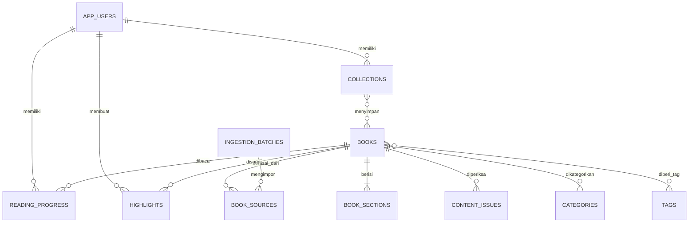

# Database Schema

Database yang direkomendasikan adalah PostgreSQL. Schema awal tersedia di `database/schema.sql`.

## Prinsip desain

- PDF dan checksum disimpan terpisah dari entitas buku.
- Satu buku terdiri dari banyak bagian terurut.
- Kategori dan tag bersifat many-to-many agar dapat dikoreksi admin.
- Hasil otomatis tidak pernah langsung menjadi `published`.
- Buku hanya boleh dipublikasikan setelah hak penggunaan diverifikasi.
- Progres, highlight, bookmark, dan koleksi terikat pada akun pengguna.
- Highlight menyimpan konteks teks agar dapat dipasangkan kembali jika isi diperbarui.

## Relasi utama

## Tabel konten

### `books`

Metadata katalog, status workflow, statistik baca, dan search vector judul/penulis/deskripsi.

Constraint penting:

- Buku published wajib memiliki hak penggunaan terverifikasi.
- Buku published wajib memiliki judul, penulis, minimal dua halaman, dan minimal 800 kata.

### `book_sources`

Menyimpan hubungan buku dengan PDF sumber:

- Nama file.
- Path internal.
- URL sumber.
- SHA-256 unik.
- Batch ingestion.
- Metadata tambahan.

Checksum unik mencegah file yang sama diimpor dua kali.

### `book_sections`

Isi reader yang telah dibersihkan:

- Urutan.
- Judul bagian.
- Isi.
- Halaman sumber.
- Versi konten.
- Search vector isi.

### `content_issues`

Antrean quality review dari pipeline, misalnya:

- `INVALID_TITLE`
- `MISSING_ORIGINAL_AUTHOR`
- `NO_SECTION_STRUCTURE`
- `LOW_WORD_COUNT`
- `VERY_SHORT_SECTION`

## Tabel pengguna

### `reading_progress`

Satu baris per pengguna dan buku. Menyimpan bagian aktif, posisi, progres total, dan status baca.

### `highlights`

Menyimpan teks yang dipilih, catatan, posisi, konteks sebelum/sesudah, dan versi konten.

### `collections` dan `collection_books`

Mendukung koleksi bawaan seperti “Ingin Dibaca” maupun koleksi buatan pengguna.

## Pencarian

Schema menggunakan PostgreSQL full-text search dengan konfigurasi `simple`, karena isi berbahasa Indonesia dan konfigurasi stemming Indonesia belum tersedia secara bawaan.

Bobot:

- A: judul, penulis, judul bagian.
- B: deskripsi.
- C: isi rangkuman.

Tahap berikutnya dapat menambahkan trigram untuk typo tolerance dan vector database untuk pencarian semantik.

## Urutan impor JSON ke database

1. Buat `ingestion_batches`.
2. Upsert `books` berdasarkan slug dan checksum sumber.
3. Insert `book_sources`.
4. Insert `book_sections` berdasarkan `order_index`.
5. Upsert kategori dan tag.
6. Insert `book_categories` dan `book_tags`.
7. Insert semua `quality.issues` ke `content_issues`.
8. Tetapkan status:
   - `ready_for_review` jika quality gate lolos.
   - `needs_review` jika terdapat masalah pemblokir.
9. Admin memeriksa dan mengubah status ke `published` setelah hak konten terverifikasi.

## Catatan autentikasi

`app_users.auth_provider_id` disiapkan untuk penyedia autentikasi eksternal. Password sebaiknya tidak dikelola langsung oleh schema aplikasi kecuali ada kebutuhan khusus dan implementasi keamanan yang memadai.
