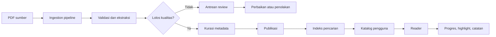
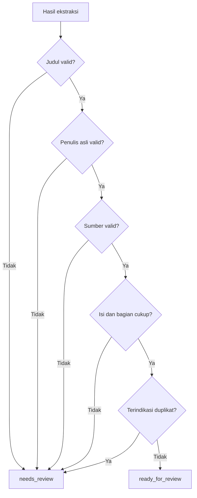
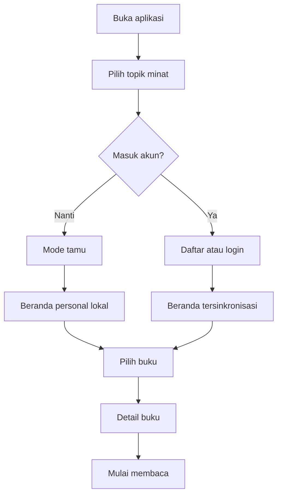
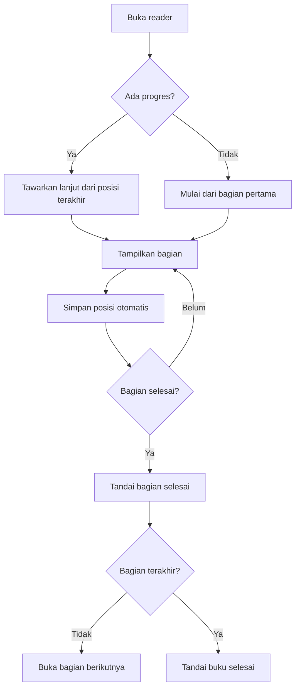
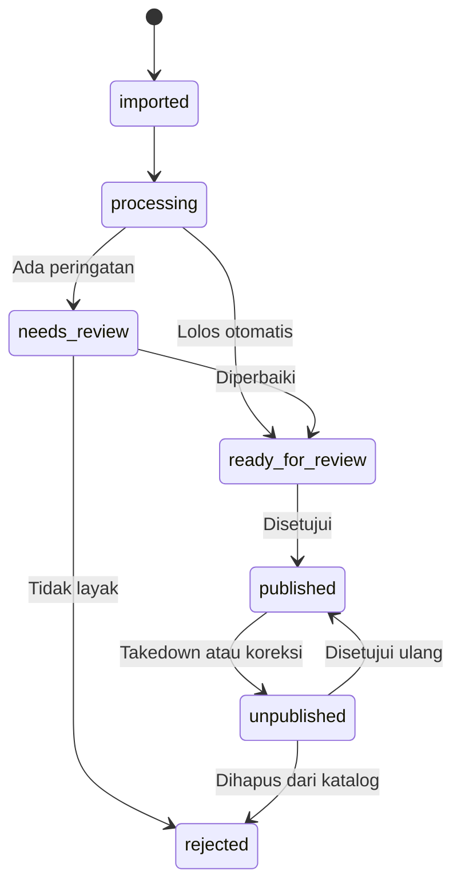

# Workflow — Ebook Summary Reader

Dokumen ini menjelaskan alur konten, pengguna, admin, dan sistem untuk MVP.

## 1. Gambaran alur utama



## 2. Workflow ingestion konten

### 2.1 Trigger

Pipeline berjalan ketika:

- Admin mengunggah PDF.
- Folder dataset dipindai secara manual.
- Batch impor terjadwal menemukan file baru.

### 2.2 Discovery

1. Sistem membaca seluruh file `.pdf`.
2. Sistem mencatat path, ukuran, waktu modifikasi, dan checksum SHA-256.
3. Sistem mencari checksum yang sama di database.
4. File duplikat dilewati dan dicatat.
5. File baru dibuat dengan status `imported`.

Output:

- `source_file`
- `checksum`
- `file_size`
- `import_batch_id`
- `status`

### 2.3 Validasi PDF

1. Buka dokumen.
2. Hitung halaman.
3. Coba ekstrak teks setiap halaman.
4. Catat halaman kosong dan error.
5. Tolak atau karantina dokumen yang tidak dapat dibaca.

Aturan awal:

- 0 halaman teks: `rejected`.
- 1 halaman: `needs_review`.
- Rasio halaman kosong tinggi: `needs_review`.
- Ekstraksi berhasil dan isi cukup: lanjut.

### 2.4 Ekstraksi metadata

Parser membaca halaman pertama dan mencari:

- Judul pertama sebelum label `Author`.
- URL setelah label `Source`.
- Judul yang berulang setelah identitas penerbit rangkuman.
- Penulis buku asli setelah pengulangan judul.

Contoh pola dataset:

```text
Atomic Habits
Author: F15 LIBRARY
Source: https://...
Atomic Habits
F15 LIBRARY
Atomic Habits
James Clear
...
```

Hasil yang disimpan:

- `title = Atomic Habits`
- `summary_publisher = F15 LIBRARY`
- `original_author = James Clear`
- `source_url = https://...`

Jika penulis asli tidak dapat ditemukan, status menjadi `needs_review`.

### 2.5 Normalisasi isi

1. Gabungkan teks berdasarkan urutan halaman.
2. Hapus header identitas dari halaman pertama.
3. Hapus footer atau elemen berulang.
4. Normalisasi spasi, tanda kutip, bullet, dan karakter Unicode.
5. Pertahankan paragraf.
6. Deteksi heading seperti `Bagian 1`, `Bagian 2`, dan seterusnya.
7. Pecah konten menjadi `BookSection`.
8. Simpan hubungan bagian ke halaman sumber.

Fallback:

- Jika heading tidak ditemukan, buat bagian berdasarkan halaman.
- Item fallback otomatis masuk `needs_review`.

### 2.6 Enrichment

Sistem menghasilkan saran:

- Deskripsi katalog singkat.
- Satu atau dua kategori utama.
- Tag topik.
- Estimasi waktu baca berdasarkan jumlah kata.
- Slug.

Enrichment otomatis tidak langsung dipublikasikan. Nilainya dapat diperiksa admin.

### 2.7 Quality gate



Pemeriksaan otomatis:

- Judul bukan `Untitled`.
- Penulis bukan kosong atau hanya nama penerbit rangkuman.
- URL menggunakan HTTPS dan host yang diizinkan.
- Isi melewati batas minimum kata.
- Jumlah bagian masuk akal.
- Tidak ada blok header yang tersisa di isi reader.
- Tidak identik atau sangat mirip dengan buku lain.

### 2.8 Review admin

Admin melihat:

- Preview PDF.
- Preview teks hasil ekstraksi.
- Judul, penulis, sumber, kategori, dan tag.
- Peringatan kualitas.
- Kemiripan dengan item lain.

Admin dapat:

- Memperbaiki metadata.
- Menggabungkan atau memisahkan bagian.
- Mengubah kategori dan tag.
- Menolak konten.
- Menandai hak penggunaan telah diverifikasi.
- Mempublikasikan.

### 2.9 Publikasi

Sebelum publish, sistem memastikan:

- Quality gate lolos.
- Review metadata selesai.
- Status hak penggunaan sesuai kebijakan produk.
- Slug unik.

Setelah publish:

1. Data tersedia melalui API katalog.
2. Teks masuk ke indeks pencarian.
3. Cache katalog dibersihkan.
4. Event audit publikasi dicatat.

## 3. Workflow pengguna baru



Aturan:

- Mode tamu menyimpan progres di perangkat.
- Saat pengguna membuat akun, sistem menawarkan migrasi data lokal.
- Onboarding hanya ditampilkan sekali kecuali direset.

## 4. Workflow menemukan buku

### Dari beranda

1. Pengguna melihat rekomendasi.
2. Pengguna membuka kartu buku.
3. Detail buku ditampilkan.
4. Pengguna mulai membaca atau menyimpan ke koleksi.

### Dari pencarian

1. Pengguna mengetik kata kunci.
2. Sistem menampilkan saran judul dan penulis.
3. Sistem menjalankan pencarian penuh setelah jeda singkat atau submit.
4. Pengguna menggunakan filter.
5. Pengguna memilih hasil.
6. Sistem mencatat query dan posisi hasil yang dipilih.

Kondisi tanpa hasil:

- Tampilkan koreksi ejaan sederhana.
- Tawarkan kategori terkait.
- Catat query untuk evaluasi katalog.

## 5. Workflow membaca



Penyimpanan progres:

- Saat reader dibuka.
- Saat pengguna pindah bagian.
- Secara berkala selama membaca.
- Saat aplikasi masuk background.
- Saat reader ditutup.

Konflik lintas perangkat:

- Gunakan nilai `last_read_at` terbaru.
- Jangan menghapus status selesai karena perangkat lama mengirim progres lebih rendah.

## 6. Workflow highlight dan catatan

1. Pengguna memilih teks.
2. Toolbar menampilkan Highlight, Catatan, dan Salin.
3. Pengguna memilih warna atau menambahkan catatan.
4. Sistem menyimpan kutipan, posisi, buku, dan bagian.
5. Highlight tampil langsung di reader.
6. Highlight dapat dibuka dari halaman Insight Saya.

Jika isi buku diperbarui:

- Pertahankan versi konten.
- Coba pasangkan highlight menggunakan teks terpilih dan konteks sekitarnya.
- Jika tidak ditemukan, tandai highlight sebagai `orphaned` tetapi jangan dihapus.

## 7. Workflow koleksi

1. Pengguna menekan Simpan.
2. Default masuk ke `Ingin Dibaca`.
3. Pengguna dapat memilih atau membuat koleksi lain.
4. Sistem memperbarui status kartu buku.
5. Koleksi tersedia dari menu Perpustakaan Saya.

Status baca diperbarui otomatis:

- `belum_dibaca`: belum pernah membuka reader.
- `sedang_dibaca`: reader pernah dibuka dan belum selesai.
- `selesai`: bagian terakhir selesai atau progres melewati ambang.

Pengguna tetap dapat mengubah status secara manual.

## 8. Workflow offline fase 2

1. Pengguna memilih Unduh.
2. Sistem memeriksa kapasitas dan status hak akses.
3. Metadata, bagian teks, dan aset yang diizinkan disimpan lokal.
4. Perubahan progres, highlight, dan catatan masuk antrean sinkronisasi.
5. Saat online, antrean dikirim ke server.
6. Konflik diselesaikan berdasarkan waktu dan aturan progres.

PDF asli tidak wajib diunduh jika pengalaman reader sudah menggunakan teks terstruktur.

## 9. Workflow penanganan error

### Import gagal

- Catat file, tahap, dan pesan error.
- Lanjutkan file berikutnya.
- Admin dapat menjalankan ulang satu item atau satu batch.

### Ekstraksi parsial

- Simpan hasil sementara.
- Tandai halaman yang gagal.
- Status `needs_review`.

### Reader gagal memuat

- Coba ulang permintaan.
- Gunakan cache lokal jika tersedia.
- Tawarkan PDF fallback jika file dapat diakses.
- Catat error tanpa menyertakan catatan pribadi pengguna.

### Sinkronisasi gagal

- Simpan perubahan lokal.
- Tampilkan status belum tersinkron.
- Gunakan retry dengan jeda bertambah.

## 10. Workflow takedown dan koreksi konten

1. Permintaan takedown atau koreksi diterima.
2. Admin mencari buku berdasarkan judul atau URL sumber.
3. Buku diubah ke `unpublished`.
4. Item hilang dari katalog dan indeks pencarian.
5. Bukti permintaan dan tindakan disimpan.
6. Konten diperbaiki, ditolak permanen, atau dipublikasikan ulang setelah evaluasi.

Data pribadi pengguna seperti catatan tidak dihapus otomatis. Jika buku dihapus permanen, pengguna diberi opsi mengekspor catatan mereka.

## 11. Status konten



## 12. Urutan implementasi yang direkomendasikan

### Sprint 0 — fondasi

- Finalisasi kebijakan lisensi dan status hak konten.
- Definisikan schema database.
- Buat sampel kurasi 20–30 PDF.
- Tetapkan aturan parser dan quality gate.

### Sprint 1 — ingestion

- Scanner file dan checksum.
- Ekstraksi teks per halaman.
- Parser metadata.
- Pemisahan bagian.
- Laporan kualitas batch.

### Sprint 2 — admin

- Daftar item hasil impor.
- Preview PDF dan hasil ekstraksi.
- Form koreksi metadata.
- Status review dan publish.

### Sprint 3 — katalog pengguna

- Beranda.
- Kategori.
- Pencarian.
- Detail buku.

### Sprint 4 — reader

- Reader teks.
- Daftar isi.
- Tema dan tipografi.
- Progres baca.

### Sprint 5 — akun dan perpustakaan

- Autentikasi.
- Sinkronisasi progres.
- Koleksi.
- Bookmark, highlight, dan catatan.

### Sprint 6 — stabilisasi

- Analitik.
- Aksesibilitas.
- Pengujian performa.
- Penanganan error.
- Kurasi 50–100 judul untuk rilis awal.

## 13. Checklist kesiapan rilis

### Konten

- [ ] Hak penggunaan telah diverifikasi.
- [ ] Tidak ada item `Untitled` yang dipublikasikan.
- [ ] Semua buku mempunyai penulis asli.
- [ ] Semua buku mempunyai atribusi sumber.
- [ ] Kategori dan tag telah diperiksa.
- [ ] Minimal 50 judul telah dikurasi manual.

### Produk

- [ ] Pencarian judul, penulis, dan isi berjalan.
- [ ] Reader nyaman pada layar ponsel.
- [ ] Progres tersimpan setelah aplikasi ditutup.
- [ ] Highlight dan catatan dapat dibuka kembali.
- [ ] Empty state dan error state tersedia.

### Operasional

- [ ] Admin dapat unpublish dengan cepat.
- [ ] Audit log aktif.
- [ ] Backup database dan file diuji.
- [ ] Monitoring error aktif.
- [ ] Kontak dan prosedur takedown tersedia.

